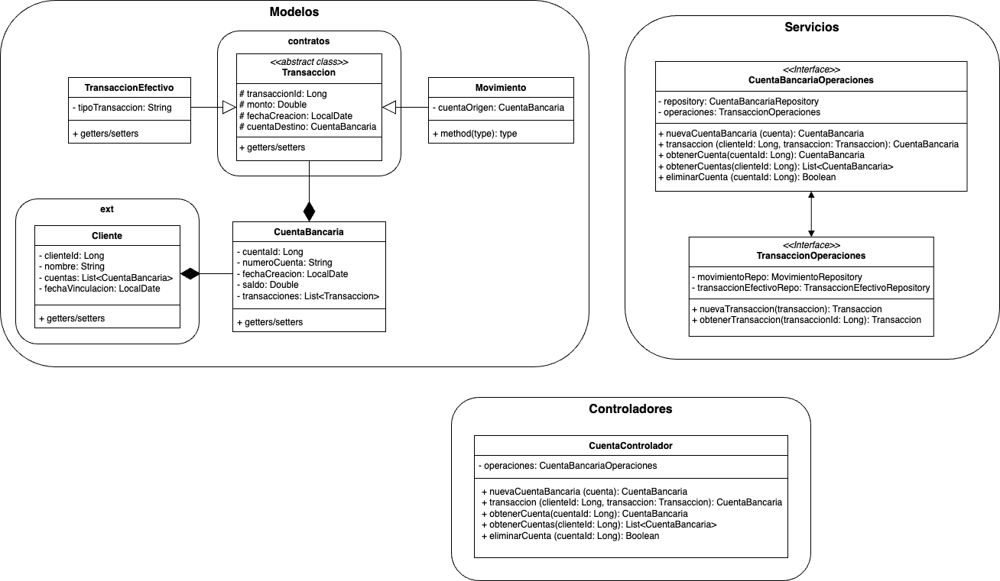

# Microservicio de Cuentas Bancarias

El presente trabajo referencia la construcción de un microservicio de cuentas bancarias. Permite abrir cuentas y realizar diferentes operaciones transaccionales; simulando transacciones en efectivo y movimientos bancarios entre diferentes cuentas. En la Figura 1, se puede apreciar la _arquitectura de la aplicación_.

Figura 1. Arquitectura de la aplicación.

esto es una prueba x2
